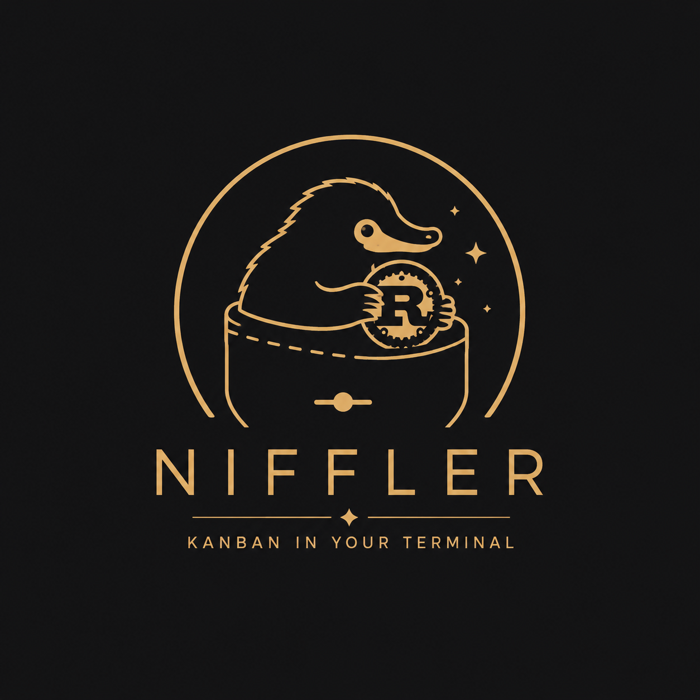
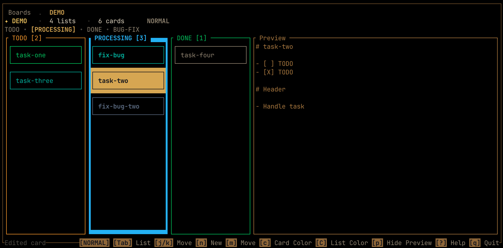

<p align="center">
  
</p>

<h1 align="center">Niffler</h1>

<p align="center">
  A warm, keyboard-first terminal Kanban board built on plain local Markdown files.
</p>

Niffler is a local-first TUI Kanban app built with Rust, Crossterm, and Ratatui. It keeps boards as plain directories and cards as ordinary Markdown files, with lightweight `.niffler.yaml` metadata for board settings, list order, colors, theme, and preview state.

There is no database and no lock-in. Your cards are just `.md` files, so you can move them into another notes app, commit them to Git, sync them with Dropbox/iCloud/Syncthing, publish them, archive them, or edit them with any text editor.

The interface is designed to feel like a polished terminal tool: fast navigation, compact status bars, modal command cards, and a warm gold palette inspired by a magical collector's notebook.

## Demo



## Features

- Board browser with live board details
- Full-screen Kanban board view
- Keyboard-only list and card navigation
- Create, rename, delete, and move boards, lists, and cards
- Optional card preview panel, persisted per board
- Portable local Markdown cards with frontmatter metadata
- External editor support via `NIFFLER_EDITOR` or `EDITOR`
- Local data storage with no server

## Install

Install the Niffler package from crates.io:

```sh
cargo install niffler-tui
```

Then launch the app with the `niffler` command:

```sh
niffler
```

The crates.io package is named `niffler-tui` because `niffler` is already used by another crate. The installed command remains `niffler`, so the end-user experience keeps the Niffler name.

For local development, run directly from the repository:

```sh
cargo run
```

## Data Location

By default, Niffler stores data in:

```text
~/.niffler
```

Override it with:

```sh
export NIFFLER_HOME=/path/to/boards
```

A board looks like this:

```text
~/.niffler/
  config.yaml
  my-board/
    .niffler.yaml
    todo/
      first-card.md
    done/
      shipped.md
```

Cards are regular Markdown files. Niffler only adds small frontmatter fields such as `position`, `created_at`, and `updated_at`.

Global display settings live in `config.yaml`. Niffler writes default theme and picker colors there, so every board shares the same palette:

```yaml
theme:
  active_selection: "#daad52"
  selected_text: "black"
  panel: "#976f3a"

colors:
  - label: Default
    value: "#3c3c3c"
  - label: Red
    value: "#ef4444"
```

Board-local settings stay in each board's `.niffler.yaml`:

```yaml
name: My Board
show_preview: false

lists:
  - id: todo
    title: Todo
    position: 1000
    border_color: "#ef4444"
```

That means you can take a card out of Niffler at any time:

```text
todo/plan-new-field-guide.md
```

Open it in another editor, move it to another project, store it in a Git repo, or use it as a normal note. The content remains Markdown.

## Editor

When editing a card, Niffler chooses an editor in this order:

```text
NIFFLER_EDITOR
EDITOR
vi
```

Examples:

```sh
export NIFFLER_EDITOR=nvim
export NIFFLER_EDITOR="code --wait"
```

## Shortcuts

### Home

| Key | Action |
| --- | --- |
| `j` / `k` or `Up` / `Down` | Move board selection |
| `Enter` | Open board |
| `n` | New board |
| `r` | Rename board |
| `d` | Delete board |
| `?` | Help |
| `q` | Quit |

### Board

| Key | Action |
| --- | --- |
| `j` / `k` or `Up` / `Down` | Move between cards |
| `h` / `l` or `Left` / `Right` | Move between lists |
| `Tab` / `Shift+Tab` | Next / previous list |
| `n` | New card |
| `N` | New list |
| `e` | Edit card |
| `m` | Move card |
| `M` | Move list |
| `C` | Change list border color |
| `r` | Rename card |
| `R` | Rename list |
| `d` | Delete card |
| `D` | Delete list |
| `p` | Toggle preview |
| `?` | Help |
| `Esc` | Back to board browser |
| `q` | Quit |

## Development

Run tests:

```sh
cargo test
```

Check formatting:

```sh
cargo fmt --check
```

## Philosophy

Niffler is meant to stay simple:

- Plain files over opaque databases
- Portable Markdown over app lock-in
- Fast keyboard workflows over mouse-heavy UI
- Compact terminal-native layouts over decorative screens
- Durable Markdown cards over app-specific content formats
